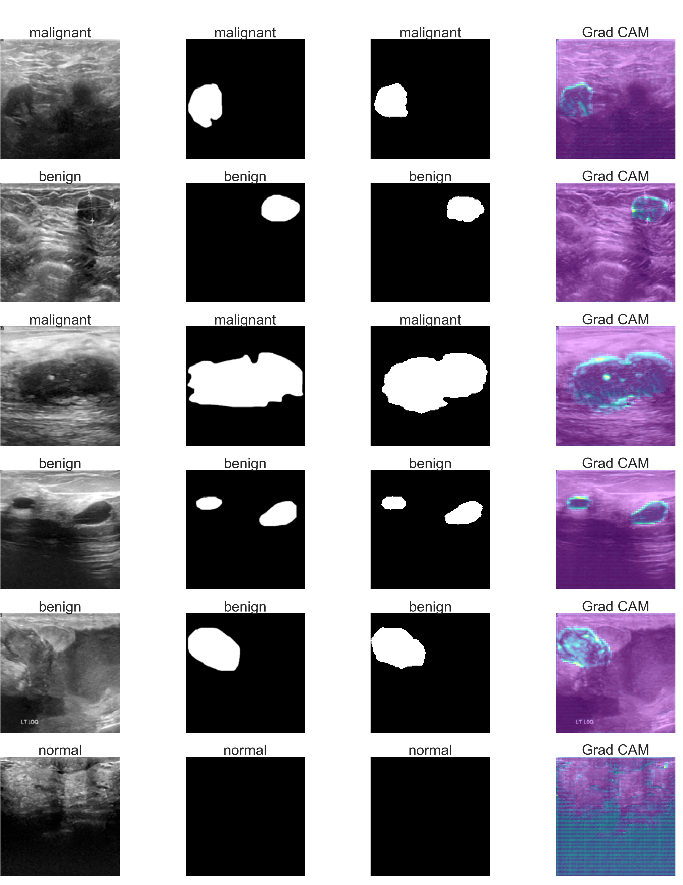

# RAUNet - Implementation of Residual Attention U-Net for semantic segmentation in Breast Ultrasound Images
The main objective of the work was to develop an artificial intelligence-based algorithm for the early detection of breast cancer types (benign/malignant) using medical images, while also paying attention to the metrics used in medical imaging. To accomplish this task, the Residual Attention U-Net architecture was employed, which has found wide applications in biomedical applications, including image segmentation. During the implementation process of the model, the TensorFlow and Keras libraries were utilized for performing complex mathematical computations on datasets of varying sizes.

## Datasets

In the training process of the developed algorithm, a publicly available dataset [1] was used, consisting of breast ultrasound images collected from 600 patients aged 25 to 75 years. The data was collected in 2018 from a hospital in Bahaye, Egypt. The scanning procedure utilized LOGIQ E9 and LOGIQ E9 Agile ultrasound machines, resulting in images with a resolution of 1280x1024. To make the dataset more useful for researchers, radiologists from that hospital performed certain operations. Duplicate images were removed, and the data was converted from DICOM format to PNG format using a specialized application. Additionally, irrelevant information was removed, and annotations were improved. Ultimately, the dataset used contains 780 images with an average size of 500x500 pixels, grouped into three classes: normal (133 images), benign tumors (437 images), and malignant tumors (210 images). Masks were manually created using Matlab software, and the entire dataset was placed in separate folders representing each class. Sample images from the database are presented in Figure 1.1.

## Implemented architectures

* RAUNet - Residual Attention U-Net for semantic segmentation in Breast Ultrasound Images
* RAUNet encoder - Residual Attention U-Net for classification in Breast Ultrasound Images

## Results

* The results showed that the model performed well in predicting true positive cases, but the most critical metric in medical imaging, recall, reached 89.74% Cohen's kappa coefficient and Matthews correlation coefficient both achieved approximately 83%, indicating a high agreement and quality of the model.

* To address the problem of false negative predictions, a second part of the algorithm focusing on image segmentation was trained. By combining both components, the algorithm successfully identified tumors in all images, eliminating the issue. The segmentation model achieved a Jaccard metric score of 75.3%.

* The final results demonstrated the algorithm's effectiveness in breast tumor classification and segmentation. Real ultrasound images were accurately classified, with corresponding masks generated by radiologists. The algorithm's predictions and the specific regions it focused on during mask creation were highlighted.

* In summary, the developed algorithm based on Residual Attention U-Net architecture, along with image segmentation, showcased promising results in the early detection of breast cancer types using medical images.

<p align="center">
  
</p>
<p align="center">
  
</p>

## Installation steps

1. Create new virtual environment:
    
    ```
    conda create --name raunet python=3.10
    ```

2. Activate environment
    ```
    conda activate raunet
    ```

3. Update _pip_ version:
    ```
    python -m pip install --upgrade pip
    ```
4. Install _raunet_ package:

    ```
    python -m pip install -e .[dev] --extra-index-url https://download.pytorch.org/whl/cu117
    ```
5. Enable precommit hook:
    ```
    pre-commit install
    ```

## References 
1. Dataset Name: [Breast Ultrasound Images Dataset](https://www.kaggle.com/aryashah2k/breast-ultrasound-images-dataset)
    - Dataset Authors: [Arya Shah](https://www.kaggle.com/aryashah2k)
    - Dataset License: [CC BY-SA 4.0](https://creativecommons.org/licenses/by-sa/4.0/)

2. Residual Attention U-Net Architecutre: [Residual Attention U-Net](https://arxiv.org/abs/1909.10360)

## License

This repository is licensed under the [MIT License](LICENSE).
